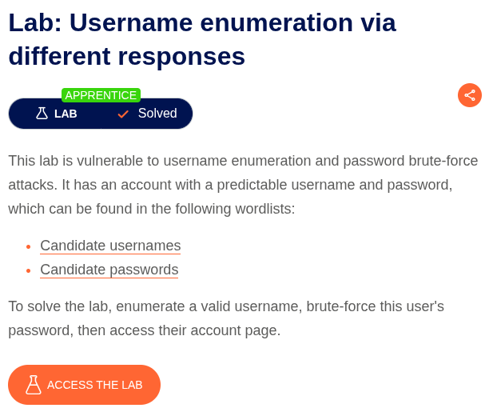
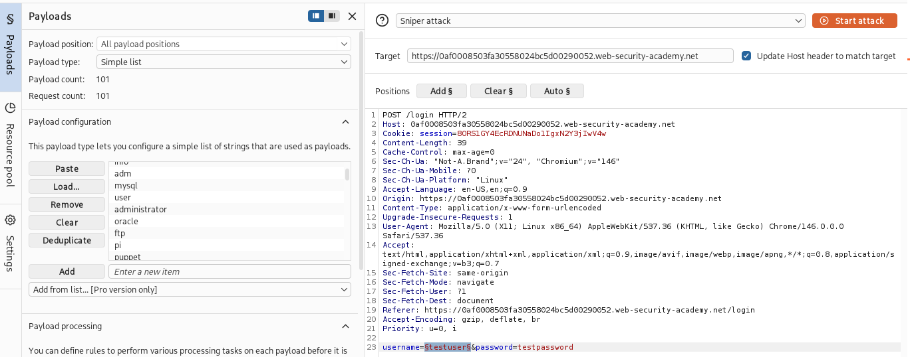
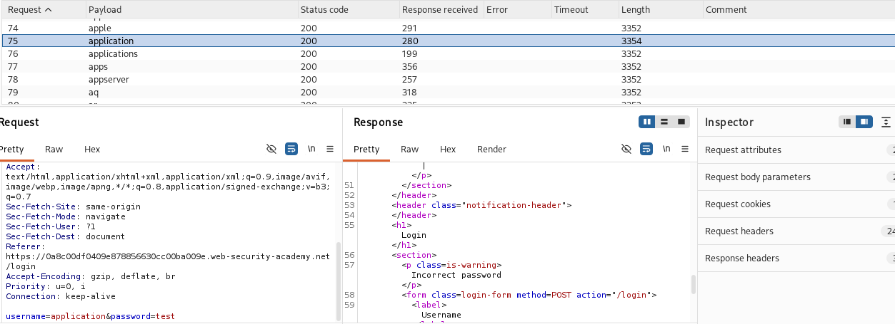
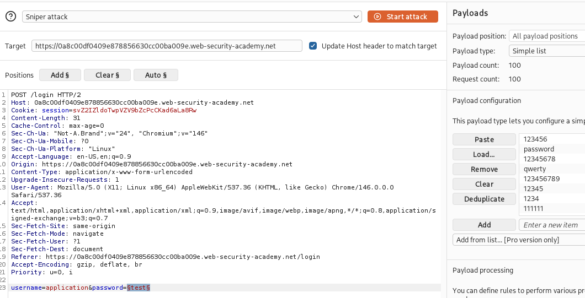
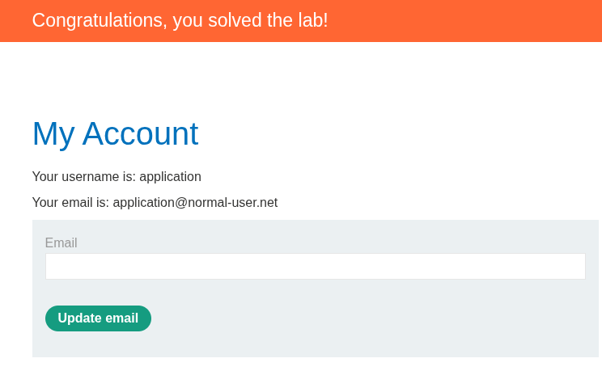

# Username Enumeration via Different Responses

**Lab:** Username enumeration via different responses
**Category:** Authentication
**Difficulty:** Apprentice
**Platform:** PortSwigger Web Security Academy

---

## Overview

This lab demonstrates a **username enumeration** vulnerability caused by the application returning different responses for valid versus invalid usernames. This behavioural difference allows an attacker to distinguish real accounts from non-existent ones, which reduces a blind credential-guessing problem into a targeted attack. Once a valid username is confirmed, the absence of rate limiting enables a password brute-force attack against that specific account.

---

## Objective

- Enumerate a valid username using the provided candidate username wordlist.
- Brute-force the password for the identified account using the candidate password wordlist.
- Authenticate and access the user's account page to solve the lab.

---

## Vulnerability Classification

| Attribute | Detail |
|---|---|
| Vulnerability | Username Enumeration via Response Differences |
| Root Cause | Inconsistent authentication responses (verbose error messaging) |
| OWASP Mapping | OTG-AUTHN-004 / Identity & Authentication Failures |
| Impact | Account discovery leading to targeted brute-force and account takeover |

---

## Methodology

### 1. Environment Setup

Burp Suite was configured as an intercepting proxy with all traffic routed through it. The target lab domain was added to **Target > Scope** to keep the workspace focused and filter out unrelated noise.

### 2. Application Mapping

The lab was accessed and the authentication surface identified. A standard login form was present, exposing two input parameters: `username` and `password`.

### 3. Username Enumeration

A login attempt was submitted and the resulting `POST /login` request captured and sent to **Burp Intruder**. Using the **Sniper** attack type, a single payload position was set on the `username` parameter, and the candidate username wordlist was loaded.

### 4. Identifying the Valid Username

The attack was executed and results sorted by **response length**. One payload produced a response with a length that deviated from all others. Cross-referencing this against the **Response** tab confirmed the difference: invalid usernames returned one error message, while the valid username returned a different response indicating the account existed.

### 5. Password Brute-Force

With the valid username identified, a second Intruder attack was configured. The `username` parameter was fixed to the confirmed value, the payload position was moved to the `password` parameter, and the candidate password wordlist was loaded. The attack was run and results were again analysed by status code and response length.

### 6. Successful Authentication

The correct password produced a distinct response — a `302` redirect indicating a successful login. Using the recovered credentials, authentication succeeded and the account page loaded, confirming the lab was solved.

---

## Root Cause Analysis

The vulnerability stems from **inconsistent authentication responses**. The application returned distinguishable feedback depending on whether the submitted username existed:

- Invalid username → one error response.
- Valid username, invalid password → a different error response ("incorrect password").

This difference, whether in the response body, message text, response length, or status code, leaks the existence of valid accounts. The design flaw is compounded by the **absence of rate limiting or account lockout**, which permits unlimited password guessing against a confirmed account. Individually, verbose responses and missing brute-force protection are each weaknesses. Chained together, they create a direct path to account takeover.

---

## Remediation

1. **Return generic, identical responses** for all failed authentication attempts, regardless of whether the username exists. A single message such as *"Invalid username or password"* should be used in every failure case.
2. **Normalise response characteristics** so that response length, status code, and timing are consistent across valid and invalid usernames, preventing side-channel enumeration.
3. **Implement rate limiting and account lockout** to throttle repeated authentication attempts and neutralise brute-force attacks.
4. **Deploy multi-factor authentication** so that a compromised password alone is insufficient to access an account.
5. **Monitor and alert** on high-volume failed login patterns indicative of enumeration or brute-force activity.

---

## Key Takeaway

Authentication systems must fail **uniformly**. Any observable difference between how an application responds to valid and invalid input, in content, length, status, or timing, becomes an oracle an attacker can exploit. Secure authentication depends not only on protecting credentials, but on ensuring the system reveals nothing about which accounts exist. Enumeration plus missing brute-force protection is a textbook chain that turns two "low severity" findings into full account compromise.

---

## Tools Used

- Burp Suite (Proxy, Intruder – Sniper attack)
- PortSwigger candidate username and password wordlists
