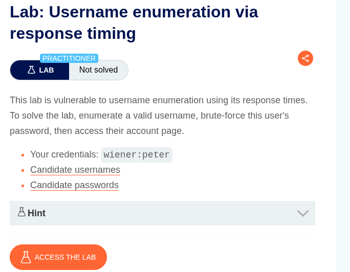
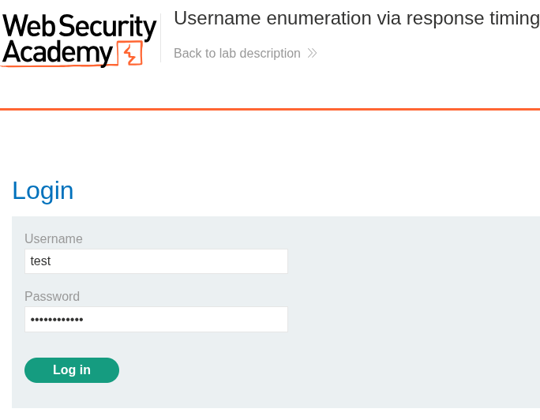
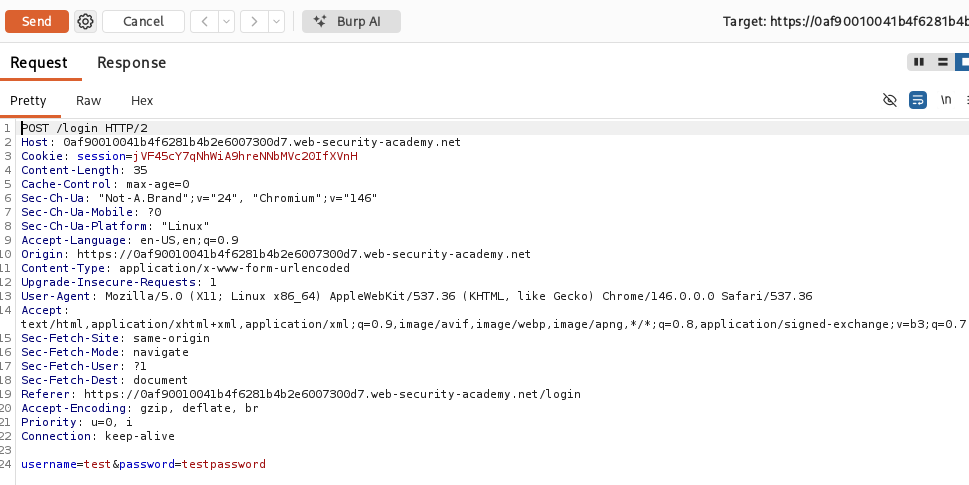
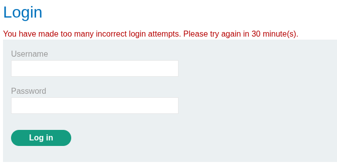
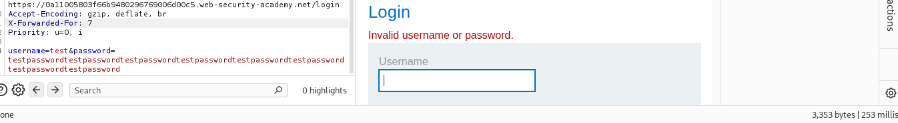
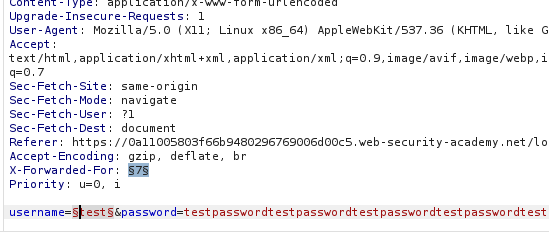
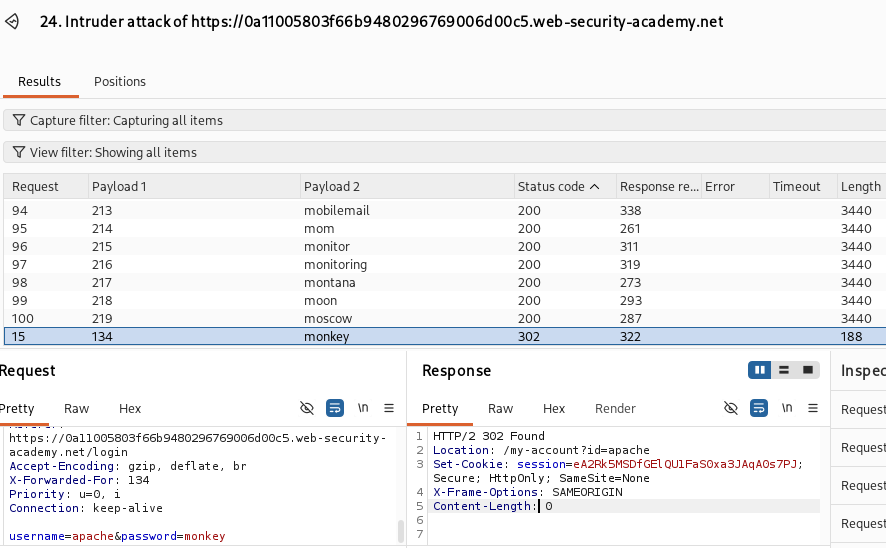
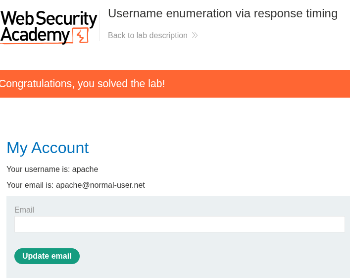

# Username Enumeration via Response Timing

**Lab:** Username enumeration via response timing
**Category:** Authentication
**Difficulty:** Practitioner
**Platform:** PortSwigger Web Security Academy

---

## Overview

This lab demonstrates a **username enumeration** vulnerability exposed through a **response-timing side channel**. Unlike enumeration via different response content, here every failure returns an identical message. The leak is temporal: the application takes measurably longer to respond when a **valid** username is submitted, because it proceeds to validate the password only after the username is accepted. That timing difference is enough to distinguish valid accounts from invalid ones.

The lab also enforces IP-based brute-force protection, which is bypassed by spoofing the `X-Forwarded-For` header.

---

## Objective

- Enumerate a valid username using response-timing analysis.
- Bypass the IP-based rate limiting using the `X-Forwarded-For` header.
- Brute-force the identified user's password.
- Authenticate and access the account page to solve the lab.

**Provided credentials:** `wiener:peter`

---

## Vulnerability Classification

| Attribute | Detail |
|---|---|
| Vulnerability | Username Enumeration via Response Timing |
| Secondary Issue | IP-based rate limiting bypass via `X-Forwarded-For` |
| Root Cause | Password validation only executed for valid usernames, creating a timing oracle |
| Impact | Account discovery leading to targeted brute-force and account takeover |

---

## Methodology

### 1. Application Mapping

With Burp Suite intercepting traffic, the application was mapped to locate the authentication surface. A login page was identified, exposing `username` and `password` parameters.

### 2. Capturing the Request

A login attempt was submitted using `test` / `testpassword` to capture the `POST /login` request in Burp. The request was forwarded to **Repeater** for detailed analysis.

### 3. Ruling Out Content-Based Enumeration

The responses were examined for subtle differences in content, status code, or length. No usable difference was found, so analysis shifted to **response timing** as the potential oracle.

### 4. Identifying the Rate-Limiting Control

After three attempts, the account was locked out by IP-based brute-force protection. To test whether this control could be bypassed, the `X-Forwarded-For` header was introduced into the request. Since the application trusted this client-supplied header to determine the source IP, rotating its value reset the rate-limit counter and bypassed the lockout entirely.

### 5. Confirming the Timing Oracle

With the lockout bypassed, response timing was compared across cases:

| Input | Response Time (ms) |
|---|---|
| Invalid username + invalid password | 207, 203, 201 (stable, low range) |
| Valid username + invalid password | 264, 500, 541, 741 (rises with longer password) |

A clear pattern emerged. For **invalid usernames**, the response time stayed in a low, stable range regardless of password length, because the application rejected the request immediately without validating the password. For **valid usernames**, the response time increased as the password field grew longer, because the application proceeded to hash and validate the password only after accepting the username. Padding the password field amplified this difference and made the valid username unmistakable.

### 6. Enumerating the Username

The request was sent to **Burp Intruder** using the **Pitchfork** attack type, with payload positions on both the `X-Forwarded-For` header and the `username` field. Placing a payload on `X-Forwarded-For` ensured each request appeared to originate from a different IP, keeping the rate limit from triggering during the attack. The candidate username list was loaded, and a long password value was used to amplify timing.

Sorting the results by **response received** time revealed the single username whose response time was significantly higher than the rest. That username was confirmed valid.

### 7. Brute-Forcing the Password

Using the identified valid username, a second Intruder attack was configured with the candidate password list from the Web Security Academy, again rotating `X-Forwarded-For` to avoid rate limiting. Results were analysed by status code and response length to identify the successful login.

### 8. Successful Authentication

The recovered credentials were used to log in, granting access to the account page and confirming the lab was solved.

---

## Root Cause Analysis

Two distinct weaknesses combined to make this attack possible.

The primary flaw is a **timing side channel**. The application only performs the computationally expensive password validation step when the submitted username is valid. This means the server's response time becomes a reliable indicator of username validity, an oracle the attacker exploits despite identical response content. Padding the password amplifies the signal because the validation cost scales with input length.

The secondary flaw is **trusting the `X-Forwarded-For` header** for rate limiting. Because this header is client-controlled, the attacker rotates it to appear as an unlimited number of distinct source IPs, completely neutralising the IP-based lockout that was meant to prevent enumeration and brute-force.

Together, the timing oracle enables username discovery and the header trust enables unlimited attempts, chaining into full account compromise.

---

## Remediation

1. **Enforce uniform response timing** for authentication attempts. Validate the password (or a dummy hash of equivalent cost) regardless of whether the username exists, so valid and invalid usernames consume the same processing time. This eliminates the timing oracle.
2. **Do not trust client-supplied headers** such as `X-Forwarded-For` for security decisions. Base rate limiting on the real connection IP observed by the server, or better, on the targeted account.
3. **Return generic, identical responses** for all failed authentication attempts, in content, status, and timing.
4. **Apply account-based lockout** in addition to IP-based controls, so an attacker cannot bypass protection simply by rotating apparent source addresses.
5. **Deploy multi-factor authentication** so a compromised password alone is insufficient to access an account.

---

## Key Takeaway

Enumeration oracles are not limited to what an application says, they extend to how long it takes to respond. Even with perfectly uniform error messages, differential processing time leaks the same information. Secure authentication must be constant-time, treating valid and invalid usernames identically in both content and computation. This lab also reinforces a foundational rule: never trust client-controllable input such as `X-Forwarded-For` for security enforcement, since doing so hands the attacker a switch to disable the very protection intended to stop them.

---

## Tools Used

- Burp Suite (Proxy, Repeater, Intruder – Pitchfork attack)
- PortSwigger candidate username and password wordlists
