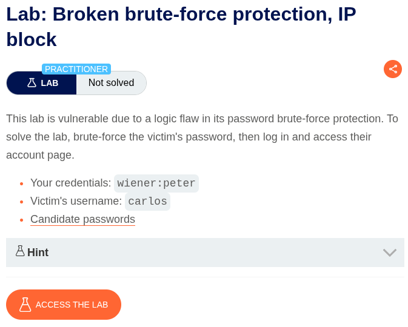
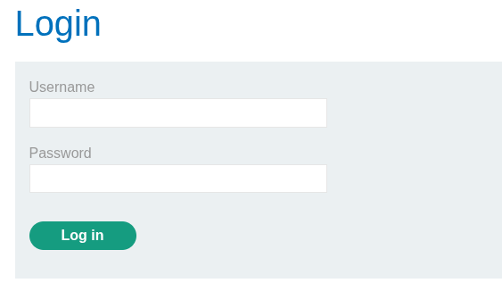
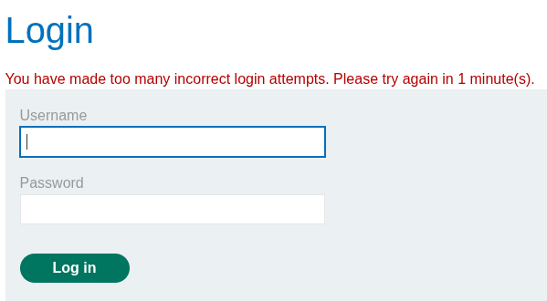
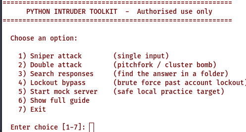
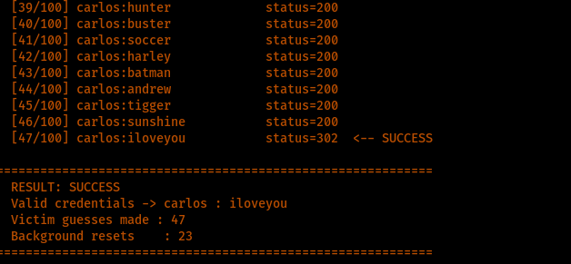
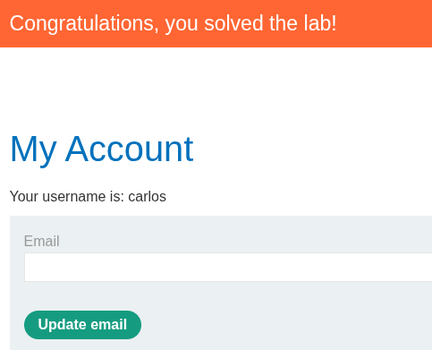

# Broken Brute-Force Protection, IP Block

**Lab:** Broken brute-force protection, IP block 

**Category:** Authentication

**Difficulty:** Practitioner

**Platform:** PortSwigger Web Security Academy



---

## Overview

This lab demonstrates **broken brute-force protection**. The application implements an account lockout that triggers after several consecutive failed login attempts, but the protection is flawed: the failed-attempt counter is reset by **any successful login from the same source**. Because the tester holds one valid account, the counter can be reset at will by periodically logging in with those valid credentials, allowing an otherwise-protected victim account to be brute-forced without ever triggering the lockout.

---

## Objective

- Understand the exact condition that triggers and resets the lockout.
- Brute-force the victim's password without tripping the protection.
- Log in as the victim and access their account page to solve the lab.

**Your credentials:** `wiener:peter`
**Victim's username:** `carlos`

---

## Vulnerability Classification

| Attribute | Detail |
|---|---|
| Vulnerability | Broken Brute-Force Protection (counter reset on successful login) |
| Root Cause | Lockout counter tracks consecutive failures from a source and is reset by any success |
| Impact | Bypass of brute-force protection leading to account takeover |

---

## Methodology

### 1. Mapping the Authentication Flow

The lab was accessed and the application mapped to locate the authentication surface. A login link was identified and opened, presenting a standard login form.



### 2. Understanding the Lockout Behaviour

The lockout logic was probed to understand precisely what triggered it. Submitting several invalid **usernames** did not trigger any lockout. However, submitting a **valid username** (`carlos`) with an incorrect password three times triggered a lockout with the message:

> "You have made too many incorrect login attempts. Please try again in 1 minute time."

This established the exact rule: the protection counts **consecutive failed attempts against a valid account from the same source**, and locks after three.



### 3. Identifying the Flaw

The critical weakness is how the counter is reset. Rather than enforcing a time-based lockout that must fully elapse, the application resets the failed-attempt counter whenever a **successful login** occurs from the same source. Because I control a valid account (`wiener:peter`), I can insert a successful login between victim guesses to reset the counter indefinitely, keeping the victim account permanently below the lockout threshold.

The required pattern, for a threshold of three, is to reset after every two failed guesses:

```
carlos : guess1      (fail 1)
carlos : guess2      (fail 2)
wiener : peter       (successful login -> resets the counter)
carlos : guess3      (fail 1)
carlos : guess4      (fail 2)
wiener : peter       (reset again)
...
```

### 4. Implementing the Bypass in a Custom Tool

Executing this pattern by hand is impractical, and Burp Intruder's resource-pool timing configuration is fiddly for interleaving credentials. Instead, I extended my own Python toolkit with a dedicated lockout-bypass mode to automate it.

> **New feature — Lockout-Bypass Mode (added to my Python toolkit).**
> A dedicated attack mode that brute-forces a victim account while automatically inserting a known-valid login to reset the failed-attempt counter before the lockout threshold is reached.
>
> **How it works:** the operator supplies their own valid credentials (used purely as background resets), the victim username, a password wordlist, and the lockout threshold. The tool submits the victim's guesses and, after every *(threshold − 1)* failures, silently performs one valid login to reset the counter. The valid credentials are **never part of the credential attack itself** — they exist only to keep the account unlocked. Success is detected by the `302` redirect returned on a correct login.
>
> **Safe development:** the feature was built and verified against a **local mock authentication server** that replicates the lab's lockout behaviour, so the logic could be developed and tested safely without directing traffic at any system I do not own. Every attack mode in the toolkit is validated this way before use.



### 5. Executing the Attack

The lockout-bypass mode was run against the lab with the victim username `carlos`, the provided password wordlist, and a threshold of three. The tool cycled the wordlist, resetting the counter as designed, and the account never locked. The correct password was identified by its `302` response.



### 6. Successful Authentication

The recovered credentials were used to log in as username: `carlos`, password: `iloveyou`, granting access to the victim's account page and solving the lab.



---

## Root Cause Analysis

The vulnerability is a **design flaw in the brute-force protection logic**. The control correctly identifies repeated failures against an account but resets its counter on the wrong signal: a successful authentication from the same source. This assumes that a legitimate user and an attacker cannot both be acting from the same source, which is false when an attacker legitimately controls one account and targets another.

The protection also appears to key on the source (IP) rather than binding attempts to the individual targeted account in isolation, which is why a success on one account (`wiener`) can clear the failure count relevant to another (`carlos`). The result is a control that looks effective in casual testing but collapses entirely against an attacker who holds any valid account.

---

## Remediation (Defensive Perspective)

Building the bypass clarified exactly how this control should be designed to hold. A robust brute-force protection would:

1. **Never reset a lockout counter on an unrelated successful login.** A time-based lockout should require the full cooldown period to elapse, regardless of other authentication activity from the same source.
2. **Track failures per targeted account, not merely per source.** Failed attempts against `carlos` should accumulate against `carlos` and not be clearable by a success on a different account.
3. **Combine multiple signals in a defence-in-depth model.** Effective protection layers per-account lockout, per-IP rate limiting, progressive delays, and CAPTCHA or step-up challenges, so defeating one layer does not defeat the control. Rate-limiting slows automation, lockout stops sustained guessing, and monitoring catches the pattern — no single layer is relied upon alone.
4. **Alert on anomalous patterns**, such as interleaved successful and failed logins from one source, which is the exact signature this attack produces.
5. **Enforce multi-factor authentication**, so that even a brute-forced password is insufficient to access an account.

---

## Key Takeaway

Brute-force protection is only as strong as the condition that resets it. This lab shows that a lockout which clears on any successful login is trivially bypassed by an attacker who controls a single valid account. From a defensive standpoint, the lesson is precise: lockout counters must be tied to the targeted account, must not be resettable by unrelated activity, and must sit within a layered, defence-in-depth model rather than acting as a single point of protection. Building the offensive automation to defeat this control is exactly what made its correct design obvious — understanding how a protection breaks is the clearest path to building one that does not.

---

## Tools Used

- Custom Python credential-testing toolkit (Lockout-Bypass mode), validated against a local mock server
- Burp Suite (Proxy, for observing the lockout behaviour)
- PortSwigger candidate password wordlist
